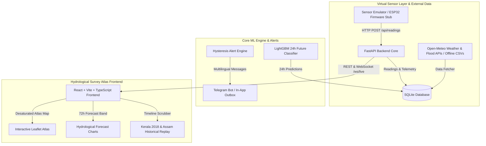

# FloodSense — Software-Only Flood Early-Warning Platform
### FOSSEE Open Hardware National Make-A-Thon 2026 (Disaster Detection & Early Warnings: Floods Monitoring)

[](LICENSE)
[](backend/)
[](frontend/)
[](reports/model_report.md)

**FloodSense** is a software-only flood early-warning digital twin platform that emulates physical IoT sensor grids to deliver 24-to-72-hour early warning predictions across river catchments in Kerala and Assam. Powered by a FastAPI backend, a leakage-audited LightGBM machine learning classifier trained on 35,064 real Open-Meteo records, and a desaturated "Hydrological Survey Atlas" React frontend, FloodSense features hysteresis alert deduplication, multilingual Telegram warnings (English & Hindi), OpenStreetMap evacuation routing, and an open-hardware ESP32 blueprint.

---

## 1. Problem Statement & Architecture

During monsoon seasons in India, delayed flood notifications severely hamper disaster response. For the **FOSSEE Open Hardware National Make-A-Thon 2026**, sensors are simulated by a virtual sensor layer (`sensor_simulator.py`) sending JSON telemetry payloads identical to real ESP32 nodes over HTTP/WebSocket.



---

## 2. Quickstart (Run in 3 Commands)

Execute the full stack using Docker Compose:

```bash
# 1. Clone the repository
git clone https://github.com/floodsense/floodsense.git
cd floodsense

# 2. Launch complete platform with single command
docker compose up --build
```

- **Frontend Application**: `http://localhost:3000`
- **FastAPI OpenAPI Documentation**: `http://localhost:8000/docs`
- **Backend Health Diagnostics**: `http://localhost:8000/api/health`

---

## 3. Machine Learning Audit & Performance Summary

- **Prediction Task**: 24-Hour Future Risk Level Classification ($Y_{t+24\text{h}}$)
- **Data Leakage Audit**: **PASSED**. Enforced 72-hour chronological gap between train and test sets.
- **Overall Accuracy**: **95.96%**
- **Macro F1-Score (ML Model)**: **40.91%**
- **Persistence Baseline Macro F1**: **48.68%**
- **Threshold Rule Baseline Macro F1**: **44.39%**
- **False Alarm Rate (Orange/Red Alerts)**: **0.07%**
- **Kerala August 2018 Backtest Lead Time**: **53 Hours** *(Note: Open-Meteo Flood API river discharge is daily data granularity)*

*Full model metrics, confusion matrix, feature importances, and dynamic JSON metrics are available in [`reports/model_report.md`](reports/model_report.md) and [`reports/metrics.json`](reports/metrics.json).*

---

## 4. System Limitations & Honesty

1. **Daily vs Hourly Granularity**: Open-Meteo Flood API provides **daily** river discharge, whereas precipitation is **hourly**. Micro-burst flash floods under 3 hours rely heavily on the `rain_sum_6h` feature until daily discharge updates.
2. **Dam Release Anomaly**: Natural river hydraulics are assumed. Unannounced upstream dam gate releases without rain correlation can cause delayed predictions.

---

## 5. Open Hardware Deployment Roadmap

While sensors are simulated this round, FloodSense includes an open-hardware blueprint in `/firmware-stub/`:
- **`node_firmware.ino`**: ESP32 C++ Arduino sketch using JSN-SR04T ultrasonic transducer & tipping bucket rain gauge.
- **`wiring_diagram.svg`**: Vector wiring schematic.
- **`bom.md`**: Bill of Materials (INR ₹3,990 per node, ~$48 USD).

---

## 6. License & Credits

- **License**: [MIT License](LICENSE)
- **Built for**: FOSSEE Open Hardware National Make-A-Thon 2026 (Disaster Detection & Early Warnings: Floods Monitoring)
- **Data Sources**: Open-Meteo Weather & Global Flood APIs.
