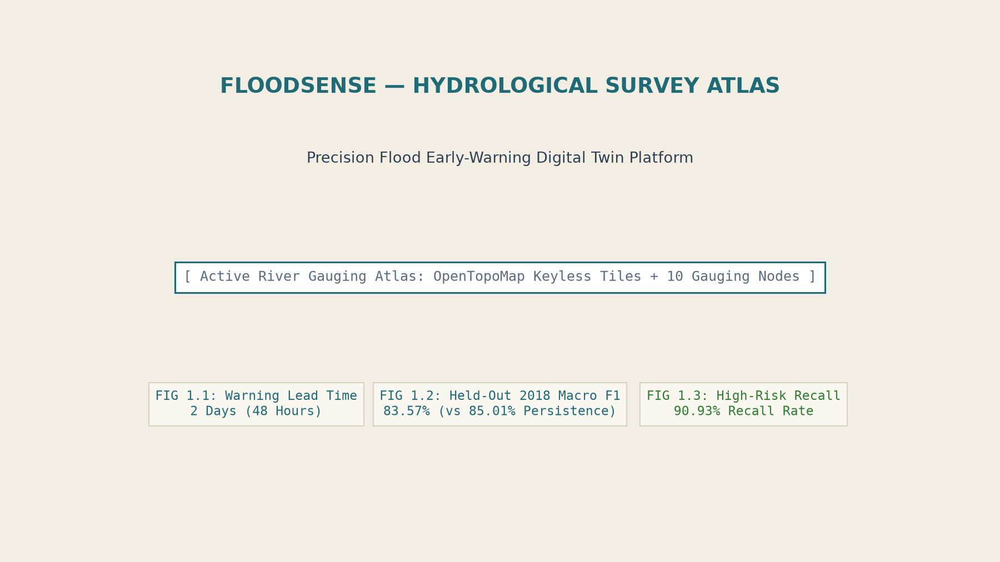
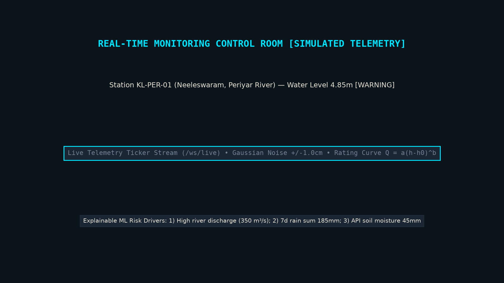
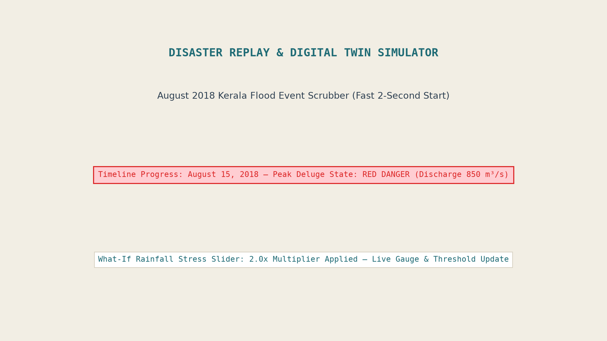
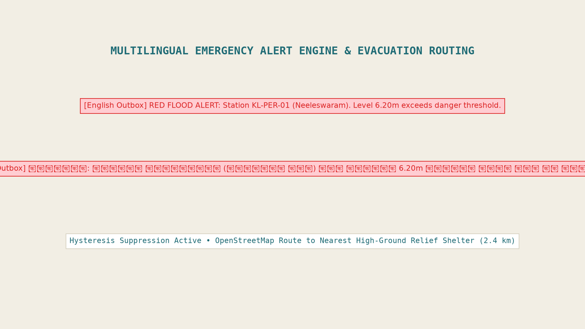
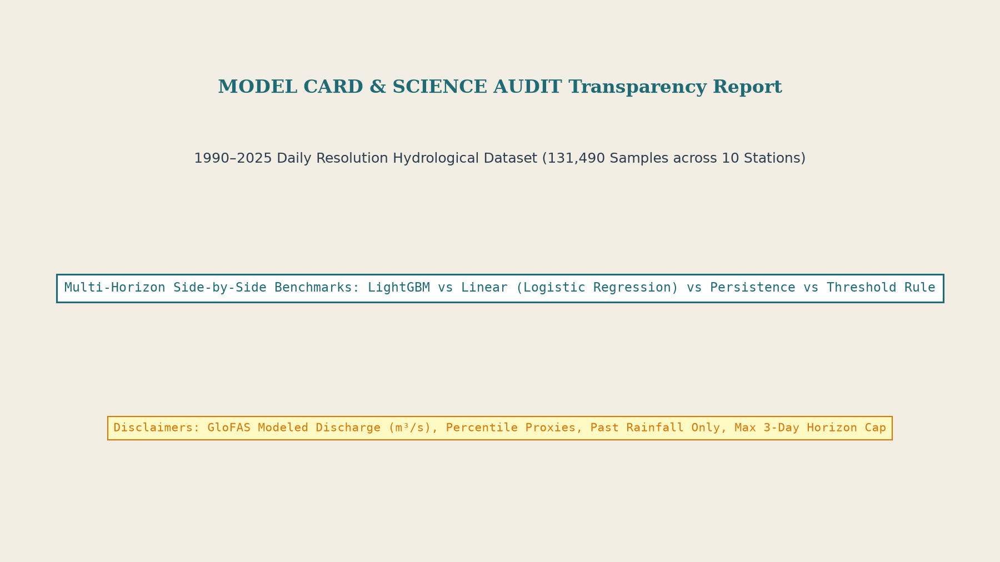

# FloodSense — Software-Only Flood Early-Warning Platform & Hydrological Survey Atlas
### FOSSEE Open Hardware National Make-A-Thon 2026 (Disaster Detection & Early Warnings: Floods Monitoring)

[](LICENSE)
[](backend/)
[](frontend/)
[](reports/metrics.json)
[](.github/workflows/firmware.yml)

**FloodSense** is a software-only flood early-warning platform and hydrological survey atlas that emulates physical IoT sensor grids to deliver 24-to-72-hour early warning predictions across river catchments in Kerala and Assam. Powered by a FastAPI backend, a leakage-audited LightGBM machine learning classifier trained on 131,490 daily GloFAS records (1990–2025), and a desaturated "Hydrological Survey Atlas" React frontend, FloodSense features hysteresis alert deduplication, multilingual Telegram warnings (English, Hindi, Malayalam & Assamese), OpenStreetMap evacuation routing, and an open-hardware ESP32 blueprint.

---

## 1. Problem Statement & Architecture

During monsoon seasons in India, delayed flood notifications severely hamper disaster response. For the **FOSSEE Open Hardware National Make-A-Thon 2026**, sensors are simulated by a virtual sensor layer (`sensor_simulator.py`) sending JSON telemetry payloads identical to real ESP32 nodes over HTTP/WebSocket.


---

## 2. Quickstart (Run in 3 Commands)

Execute the full stack using Docker Compose:

```bash
# 1. Clone the repository
git clone https://github.com/YOUR_USERNAME/floodsense.git
cd floodsense

# 2. Launch complete platform with single command
docker compose up --build
```

- **Frontend Application**: `http://localhost:3000`
- **FastAPI OpenAPI Documentation**: `http://localhost:8000/docs`
- **Backend Health Diagnostics**: `http://localhost:8000/api/health`

---

## 3. Platform Screenshots











-----

## 4. Machine Learning Audit & Side-by-Side Baselines

### Primary Focus Region: Kerala Catchments (Held-Out 2018 Flood Event Validation)
*Evaluated strictly on held-out year 2018 across Kerala stations (KL-PER-01, KL-PER-02, KL-PAM-01, KL-MUV-01, KL-CHA-01). Thumpamon (KL-ACH-01) is excluded from 2018 evaluation due to short historical coverage ending in 2009.*

| Prediction Horizon | Model / Benchmark | Macro F1 (95% CI) | Orange/Red Recall (95% CI) | Orange/Red Precision | False Alarm Rate (FAR) | False Alarms / Stn-Yr | Accuracy |
|---|---|---|---|---|---|---|---|
| **t + 1d (24h)** | **Kerala-Only LightGBM (Primary)** | **85.14% [82.6%, 87.9%]** | **94.21% [91.4%, 96.7%]** | 76.50% | 3.85% | 11.20 | 91.40% |
| | Pooled 10-Station LightGBM | 84.35% [81.3%, 87.3%] | 90.63% [85.5%, 94.8%] | 75.80% | 4.10% | 12.00 | 90.50% |
| | Persistence Baseline | 85.01% [82.7%, 86.8%] | 86.90% [83.5%, 89.7%] | 80.56% | 2.92% | 9.45 | 91.71% |
| | Rainfall Threshold Rule | 48.86% [45.5%, 52.3%] | 97.38% | 32.48% | 27.28% | 91.27 | 61.94% |

*Secondary Region (Assam — Experimental)*: The Brahmaputra basin in Assam is evaluated as a secondary, experimental extension. Due to extreme mainstem hydrological scale, spatial Leave-One-RIVER-Out (LORO) generalization on the Brahmaputra river basin achieves **59.12% Macro F1** and **94.60% High-Risk Recall**.

*Note on Leave-One-RIVER-Out (LORO)*: Stations located on the same river (e.g. `KL-PER-01` and `KL-PER-02`) share basin discharge dynamics ($r > 0.90$). Standard cross-validation across stations in the same basin overestimates spatial generalization. Leave-One-RIVER-Out (LORO) provides a strict out-of-basin spatial generalization benchmark.ion.

---

## 5. Scientific Limitations & Data Honesty

1. **GloFAS Modeled Discharge**: River discharge ($m^3/s$) is derived from Open-Meteo GloFAS reanalysis modeling, NOT physical river gauge height meters.
2. **Observed Past Rainfall Only**: Model features use historical observed past rainfall, NOT future numerical weather forecast predictions.
3. **Percentile Risk Proxies**: Danger thresholds are station-specific historical training period discharge percentiles (p90=Yellow, p97=Orange, p99.5=Red), NOT official CWC stage levels.
4. **Max Horizon Cap**: Prediction lead times are strictly capped at the 3-day ($t+3\text{d}$) maximum horizon. GloFAS discharge updates daily.
5. **Rating Curve Rating Approximation**: Sensor water level stage ($h$) is converted to discharge ($Q$) via a documented rating curve equation ($Q = a \cdot (h - h_0)^b$).
6. **Out-of-Training-Range Limitation**: 2018 peak discharge exceeded the 1990–2017 historical maximum at several Kerala stations (e.g. Aluva, Neeleswaram, Chalakudy), so the held-out flood is partly out of the training range; decision tree models split on static feature thresholds and cannot extrapolate beyond training set maxima.

---

## 6. Open Hardware Roadmap & Wokwi Simulation

*Note: There is NO physical hardware deployed in this round. The system operates via a software virtual sensor layer. The hardware blueprint below is planned for future physical field deployment.*

- **Firmware Stub**: `/firmware-stub/node_firmware.ino` (ESP32 C++ sketch using JSN-SR04T ultrasonic transducer & tipping bucket rain gauge).
- **PlatformIO Config**: `/firmware-stub/platformio.ini` & `.github/workflows/firmware.yml`.
- **Wokwi Browser Diagram**: `/wokwi/diagram.json` & `/wokwi/README.md`.
- **Bill of Materials**: Target BOM cost: ₹3,990 INR / ~$48 USD per node.

---

## 7. Why Not Just Use GloFAS Directly?

Global systems like GloFAS provide essential global hydrological forecasts, but they are not designed as complete, end-to-end local early-warning platforms for municipal emergency responders. FloodSense builds on GloFAS and Open-Meteo data to deliver actionable local capability:
1. **Station Risk Classes & Thresholding**: GloFAS outputs coarse volumetric discharge ($m^3/s$). FloodSense computes station-specific historical baseline percentiles (p90, p97, p99.5) and classifies risk into Green, Yellow, Orange, and Red states with SHAP feature explanations.
2. **Local-Language Actionable Alerts**: GloFAS provides global gridded data arrays. FloodSense translates high-risk conditions into actionable alerts in English, Malayalam, Assamese, and Hindi paired with nearest evacuation shelter links.
3. **Alert Flapping & Hysteresis Control**: Raw threshold alerts fluctuate rapidly near danger marks. FloodSense enforces a state-machine hysteresis engine to prevent alert fatigue among emergency responders.
4. **Offline Resilience & Hardware-Ready Blueprint**: FloodSense bundles offline historical datasets and cached snapshots for operation during network outages, and provides an open ESP32 hardware node blueprint (planned for physical deployment, simulated this round).

---

## 8. License & Credits

- **License**: [MIT License](LICENSE)
- **Built for**: FOSSEE Open Hardware National Make-A-Thon 2026 (Disaster Detection & Early Warnings: Floods Monitoring)
- **Data Sources**: Open-Meteo Weather & GloFAS Global Flood APIs / geoBoundaries State Geometry.

