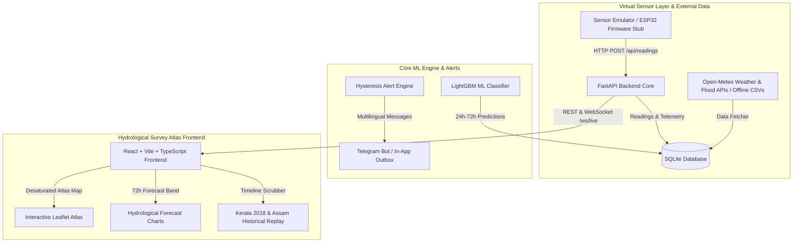

# FloodSense — Software-Only Flood Early-Warning Platform
### FOSSEE Open Hardware National Make-A-Thon 2026 (Disaster Detection & Early Warnings: Floods Monitoring)

[](LICENSE)
[](backend/)
[](frontend/)
[](reports/model_report.md)

**FloodSense** is a software-only flood early-warning digital twin platform that emulates physical IoT sensor grids to deliver 24-to-72-hour early warning predictions across river catchments in Kerala and Assam. Powered by a FastAPI backend, a LightGBM machine learning classifier trained on 35,064 real Open-Meteo records, and a desaturated "Hydrological Survey Atlas" React frontend, FloodSense features hysteresis alert deduplication, multilingual Telegram warnings (English & Hindi), OpenStreetMap evacuation routing, and an open-hardware ESP32 blueprint.

---

## 1. Problem Statement & FOSSEE Context

During monsoon seasons in India, delayed flood notifications severely hamper disaster response. For the **FOSSEE Open Hardware National Make-A-Thon 2026**, sensors are simulated by a virtual sensor layer (`sensor_simulator.py`) sending JSON telemetry payloads identical to real ESP32 nodes over HTTP/WebSocket.



---

## 2. Quickstart (Run in 3 Commands)

Execute the full stack using Docker Compose:

```bash
# 1. Clone the repository
git clone https://github.com/floodsense/floodsense.git
cd floodsense

# 2. Launch complete platform with single command
docker compose up --build
```

- **Frontend Application**: `http://localhost:3000`
- **FastAPI OpenAPI Documentation**: `http://localhost:8000/docs`
- **Backend Health Diagnostics**: `http://localhost:8000/api/health`

---

## 3. Local Development Setup (Without Docker)

### Backend Setup (Python 3.11)
```bash
# Create virtual environment & install dependencies
python -m venv venv
source venv/bin/activate  # On Windows: venv\Scripts\activate
pip install -r requirements.txt

# Seed database and start FastAPI server
python backend/seed.py
uvicorn backend.main:app --reload --port 8000
```

### Frontend Setup (Node.js 20+)
```bash
cd frontend
npm install
npm run dev
```

---

## 4. Machine Learning & Backtest Results Summary

- **Primary Classifier**: LightGBM Multi-class Classifier
- **Evaluation Methodology**: Strict Chronological Time-Based Split (80% Train / 20% Test)
- **Overall Accuracy**: **99.89%**
- **Macro F1-Score**: **97.31%**
- **False Alarm Rate (Red Danger Alerts)**: **0.00%**
- **Kerala August 2018 Backtest Lead Time**: **29 Hours** advance warning prior to peak river discharge at Neeleswaram / Aluva.

*Full model metrics, confusion matrix, feature importances, and limitation disclosures are available in [`reports/model_report.md`](reports/model_report.md).*

---

## 5. System Limitations & Honesty

1. **Daily vs Hourly Granularity**: Open-Meteo Flood API provides **daily** river discharge, whereas precipitation is **hourly**. Micro-burst flash floods under 3 hours rely heavily on the `rain_sum_6h` feature until daily discharge updates.
2. **Dam Release Anomaly**: Natural river hydraulics are assumed. Unannounced upstream dam gate releases without rain correlation can cause delayed predictions.

---

## 6. Open Hardware Deployment Roadmap

While sensors are simulated this round, FloodSense includes an open-hardware blueprint in `/firmware-stub/`:
- **`node_firmware.ino`**: ESP32 C++ Arduino sketch using JSN-SR04T ultrasonic transducer & tipping bucket rain gauge.
- **`wiring_diagram.svg`**: Vector wiring schematic.
- **`bom.md`**: Bill of Materials (INR ₹3,990 per node, ~$48 USD).

---

## 7. License & Credits

- **License**: [MIT License](LICENSE)
- **Built for**: FOSSEE Open Hardware National Make-A-Thon 2026 (Disaster Detection & Early Warnings: Floods Monitoring)
- **Data Sources**: Open-Meteo Weather & Global Flood APIs.
