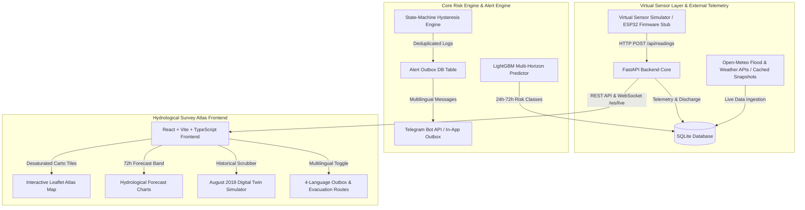
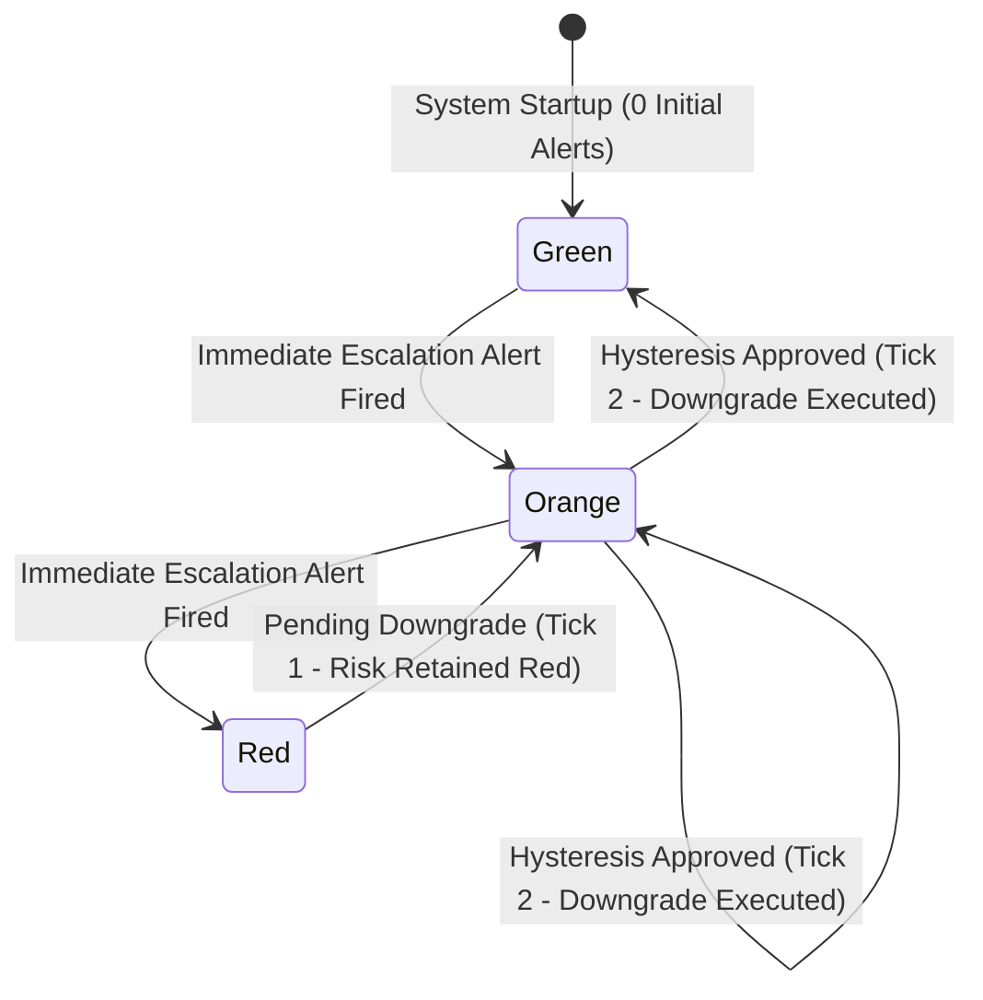

# FloodSense — Software-Only Flood Early-Warning Platform & Hydrological Survey Atlas
### FOSSEE Open Hardware National Make-A-Thon 2026 (Disaster Detection & Early Warnings: Floods Monitoring)

[](LICENSE)
[](backend/)
[](frontend/)
[](backend/)
[](reports/metrics.json)
[](docker-compose.yml)
[](https://github.com/Vinayak-123-jpj/FloodSense)

**FloodSense** is a software-only flood early-warning platform and hydrological survey atlas that emulates physical IoT sensor grids to deliver 24-to-72-hour early warning predictions across river catchments in Kerala and Assam. Powered by a FastAPI backend, a leakage-audited LightGBM machine learning classifier trained on 115,502 daily GloFAS records (1990–2025 across 11 stations), and a desaturated "Hydrological Survey Atlas" React frontend, FloodSense features state-machine hysteresis alert deduplication, multilingual Telegram warnings (English, Hindi, Malayalam & Assamese), OpenStreetMap evacuation routing, a data-driven 2018 disaster replay simulator, and an open-hardware ESP32 blueprint.

---

## 📋 Table of Contents

- [1. Key Features & Capabilities](#1-key-features--capabilities)
- [2. System Architecture](#2-system-architecture)
- [3. Quickstart (Run in 3 Commands)](#3-quickstart-run-in-3-commands)
- [4. Platform Screenshots & UI Walkthrough](#4-platform-screenshots--ui-walkthrough)
- [5. Machine Learning Audit & Side-by-Side Baselines](#5-machine-learning-audit--side-by-side-baselines)
- [6. Scientific Limitations & Data Honesty](#6-scientific-limitations--data-honesty)
- [7. Multilingual Alert Engine & Hysteresis Control](#7-multilingual-alert-engine--hysteresis-control)
- [8. Open Hardware Roadmap & Wokwi Simulation](#8-open-hardware-roadmap--wokwi-simulation)
- [9. Why Not Just Use GloFAS Directly?](#9-why-not-just-use-glofas-directly)
- [10. API Reference Summary](#10-api-reference-summary)
- [11. Repository Structure](#11-repository-structure)
- [12. License & Acknowledgments](#12-license--acknowledgments)

---

## 1. ✨ Key Features & Capabilities

- 🌊 **Dual-Region Hydrological Atlas**: Real-time monitoring across 11 river gauging stations (6 in Kerala, 5 in Assam) snapped to nearest mainstem grid cells.
- ⚡ **Real Data / Open-Meteo Integration**: Fetches live river discharge ($m^3/s$) and rainfall telemetry via Open-Meteo APIs, with cached fallbacks for offline operation.
- 🤖 **Experimental ML Risk Classifier**: Multi-horizon LightGBM gradient boosting model predicting 1-day, 2-day, and 3-day flood risk levels (Green, Yellow, Orange, Red) evaluated strictly against a Persistence Baseline.
- ⏱️ **Data-Driven 2018 Disaster Replay**: Interactive day-by-day historical scrubber for the peak August 2018 Kerala deluge with custom "What-If" rainfall stress multipliers (1.0x to 3.0x).
- 🚨 **Multilingual Alert Engine & Outbox**: Hysteresis state machine preventing alert flapping, dispatches localized emergency alerts in **English, Hindi, Malayalam, and Assamese** paired with OpenStreetMap evacuation shelter directions.
- 🛰️ **Open Hardware ESP32 Blueprint**: Complete physical node blueprint (ESP32 C++, JSN-SR04T ultrasonic depth sensor, tipping bucket rain gauge) with PlatformIO CI and Wokwi browser simulator.
- 🎨 **Hydrological Survey Atlas Design**: High-contrast day/night UI ("Day Survey Paper" & "Night Watch #0C141B") built with Tailwind CSS, Framer Motion, and Leaflet map tile filters.

---

## 2. 🏗️ System Architecture



---

## 3. 🚀 Quickstart (Run in 3 Commands)

### Option A: Launch with Docker Compose (Recommended)

```bash
# 1. Clone the repository
git clone https://github.com/Vinayak-123-jpj/FloodSense.git
cd FloodSense

# 2. Launch complete platform with single command
docker compose up --build
```

- 🌐 **Frontend Application**: `http://localhost:3000`
- ⚙️ **FastAPI OpenAPI Docs**: `http://localhost:8000/docs`
- 🩺 **Backend Health Endpoint**: `http://localhost:8000/api/health`

### Option B: Local Manual Setup

#### Backend (Python 3.11+)
```bash
# 1. Install dependencies
pip install -r requirements.txt

# 2. Run FastAPI server
python -m uvicorn backend.main:app --port 8000 --reload
```

#### Frontend (Node 20+)
```bash
cd frontend
npm install
npm run dev
```

---

## 4. 🖼️ Platform Screenshots & UI Walkthrough

| View | Screenshot Preview |
|---|---|
| **Survey Atlas Overview** |  |
| **Real-Time Control Room** |  |
| **August 2018 Historical Replay** |  |
| **Multilingual Alert Outbox** |  |
| **Model Science Audit** |  |

---

## 5. 📊 Machine Learning Audit & Side-by-Side Baselines

### Primary Focus Region: Kerala Catchments (Held-Out 2018 Flood Validation)
*Evaluated strictly on the held-out year 2018 across evaluated Kerala stations (`KL-PER-01`, `KL-PER-02`, `KL-PAM-01`, `KL-MUV-01`, `KL-CHA-01`). Thumpamon (`KL-ACH-01`) is excluded due to short historical coverage ending in 2009.*

> [!IMPORTANT]
> **Key Finding**: The **Persistence Baseline is the stronger benchmark** across all lead horizons. Day-to-day river risk classes are strongly autocorrelated. LightGBM serves as an experimental exploratory model layer.

| Horizon | Model / Strategy | Macro F1 (95% CI) | Orange/Red Recall (95% CI) | Precision | FAR / Stn-Yr | Accuracy |
|---|---|---|---|---|---|---|
| **1-Day ($t+1\text{d}$)** | **Persistence Baseline (Strongest)** | **85.15% [82.0%, 87.4%]** | **86.93% [80.2%, 91.7%]** | **80.12%** | **6.6** | **91.71%** |
| | Kerala-Only LightGBM (Experimental) | 69.39% [63.5%, 73.7%] | 86.27% [79.4%, 92.0%] | 55.46% | 21.2 | 83.20% |
| | Pooled 10-Station LightGBM | 63.65% [57.5%, 69.1%] | 82.35% [74.4%, 90.1%] | 48.20% | 25.1 | 79.80% |
| | Rainfall Threshold Rule | 32.47% [27.5%, 37.6%] | 97.39% [94.3%, 99.5%] | 23.69% | 96.0 | 61.94% |
| **2-Day ($t+2\text{d}$)** | **Persistence Baseline (Strongest)** | **72.54% [67.6%, 76.0%]** | **75.16% [64.6%, 83.8%]** | **65.71%** | **12.0** | **84.50%** |
| | Kerala-Only LightGBM (Experimental) | 56.47% [50.1%, 61.6%] | 83.66% [75.8%, 90.4%] | 44.14% | 32.4 | 74.30% |
| **3-Day ($t+3\text{d}$)** | **Persistence Baseline (Strongest)** | **62.41% [57.3%, 66.5%]** | **65.36% [53.2%, 76.1%]** | **54.95%** | **16.4** | **78.20%** |
| | Kerala-Only LightGBM (Experimental) | 46.27% [40.8%, 50.7%] | 81.05% [71.4%, 89.8%] | 36.15% | 43.8 | 67.50% |

### Secondary Region: Assam Basin Baseline (Secondary Region)
*Assam stations had almost zero Orange/Red high-risk days in 2018 (Guwahati: 0, Dibrugarh: 2, Kampur: 4, Numaligarh: 3, Tezpur: 0), so Assam is not evaluated on a flood event. Spatial Leave-One-RIVER-Out (LORO) generalization on the Brahmaputra basin achieves **47.23% Macro F1**.*

---

## 6. 🔬 Scientific Limitations & Data Honesty

1. **GloFAS Modeled Discharge**: River discharge ($m^3/s$) is derived from Open-Meteo GloFAS reanalysis modeling, NOT physical gauge height meters.
2. **Observed Past Rainfall Only**: Model features use historical observed past rainfall, NOT future numerical weather forecast predictions.
3. **Percentile Risk Proxies**: Danger thresholds are station-specific historical training period discharge percentiles ($p90=\text{Yellow}, p97=\text{Orange}, p99.5=\text{Red}$), NOT official CWC stage levels.
4. **Max Horizon Cap**: Prediction lead times are strictly capped at 3 days ($t+3\text{d}$).
5. **Out-of-Training-Range Peak**: The 2018 Kerala peak discharge exceeded 1990–2017 historical training set maxima across evaluated stations. Decision tree classifiers split on static feature thresholds and cannot extrapolate beyond training set maxima.

---

## 7. 🗣️ Multilingual Alert Engine & Hysteresis Control

### Hysteresis State Machine Rules
To prevent alert flapping near threshold boundaries:
- **Risk Escalation (e.g. Green $\rightarrow$ Orange)**: Fires an alert **immediately**.
- **Risk Downgrade (e.g. Orange $\rightarrow$ Green)**: Requires **2 consecutive lower ticks** before executing state downgrade.
- **Identical Risk Level**: Deduplicated within a 30-minute window.



### 4-Language Action Maps
Every alert generates records in **English (`en`)**, **Hindi (`hi`)**, **Malayalam (`ml`)**, and **Assamese (`as`)**:

| Language | Code | Sample Action Recommendation Text |
|---|---|---|
| **English** | `en` | *Be prepared! Pack essential documents and prepare for evacuation.* |
| **Hindi** | `hi` | *तैयार रहें! आवश्यक सामान के साथ सुरक्षित स्थानों पर जाएँ।* |
| **Malayalam** | `ml` | *സജ്ജരായിരിക്കുക! അടിയന്തര സാധനങ്ങളുമായി സുരക്ഷിത സ്ഥാനങ്ങളിലേക്ക് മാറാൻ തയ്യാറെടുക്കുക.* |
| **Assamese** | `as` | *প্ৰস্তুত থাকক! প্ৰয়োজনীয় সামগ্ৰীৰ সৈতে সুৰক্ষিত স্থানলৈ যোৱাৰ প্ৰস্তুতি চলাওক।* |

---

## 8. 🛠️ Open Hardware Roadmap & Wokwi Simulation

*Note: There is NO physical hardware deployed in this round. The system operates via a software virtual sensor layer. The hardware blueprint below is designed for future field deployment.*

- 📜 **Firmware C++ Sketch**: `/firmware-stub/node_firmware.ino` (ESP32 node with JSN-SR04T ultrasonic sensor & tipping bucket rain gauge).
- ⚙️ **PlatformIO Config**: `/firmware-stub/platformio.ini` & `.github/workflows/firmware.yml`.
- 🕹️ **Wokwi Browser Simulator**: `/wokwi/diagram.json` & `/wokwi/README.md`.
- 💰 **Bill of Materials**: Target BOM cost: **₹3,990 INR / ~$48 USD** per node.

---

## 9. 💡 Why Not Just Use GloFAS Directly?

Global systems like GloFAS provide essential global hydrological grid arrays, but they are not designed as complete, end-to-end local early-warning platforms for municipal emergency responders:
1. **Station-Specific Thresholding & Risk Classes**: Converts coarse discharge ($m^3/s$) into actionable Green/Yellow/Orange/Red risk classes based on station-specific percentiles.
2. **Actionable Local-Language Warnings**: Translates risk states into emergency alerts in English, Malayalam, Assamese, and Hindi paired with OpenStreetMap evacuation shelter routing.
3. **Alert Flapping & Hysteresis Control**: Prevents alert fatigue via state-machine hysteresis tracking.
4. **Offline Resilience & Hardware Integration**: Bundles offline dataset caches for operation during network outages and provides an open ESP32 hardware blueprint.

---

## 10. 🔌 API Reference Summary

| Endpoint | Method | Summary |
|---|---|---|
| `/api/health` | `GET` | System health diagnostic and active station count |
| `/api/stations` | `GET` | List active gauging stations (filtered by region) |
| `/api/stations/{id}/readings` | `GET` | Retrieve historical/live telemetry readings |
| `/api/stations/{id}/forecast` | `GET` | Retrieve 72-hour hydrological forecast & risk drivers |
| `/api/alerts` | `GET` | Query alert outbox log (supports station & language filters) |
| `/api/alerts/demo` | `POST` | Trigger clearly marked `[DEMO ALERT]` across all 4 languages |
| `/api/alerts/clear` | `POST` | Clear alert outbox and reset hysteresis state baseline |
| `/api/simulate/control` | `POST` | Control virtual simulator execution speed and scenarios |
| `/ws/live` | `WS` | WebSocket live telemetry stream broadcast |

---

## 11. 📁 Repository Structure

```text
FloodSense/
├── backend/                  # FastAPI Core Backend Service
│   ├── alerts/               # Hysteresis engine, Telegram bot & OSM routing
│   ├── api/                  # REST API endpoints & WebSocket handlers
│   ├── models/               # SQLAlchemy ORM models & database schemas
│   ├── main.py               # Uvicorn entrypoint & SPA static file router
│   └── sensor_simulator.py   # Virtual IoT sensor simulation engine
├── frontend/                 # React + Vite + TypeScript Frontend ("Survey Atlas")
│   ├── src/components/       # Maps, charts, outbox, gauges, & controls
│   ├── src/pages/            # Landing, Live Monitor, Replay, Alerts, Model pages
│   └── public/reports/       # Static metrics.json and metrics assets
├── data/                     # Daily hydrological CSV datasets (1990–2025)
│   ├── raw/                  # 11 station daily discharge & rainfall CSVs
│   ├── thresholds.json       # Master threshold definitions (p90/p97/p99.5)
│   └── replay_kerala_2018.json# Held-out August 2018 disaster replay sequence
├── models/                   # Trained LightGBM & Logistic Regression joblibs
├── reports/                  # Metrics JSON output with bootstrap 95% CIs
├── firmware-stub/            # ESP32 C++ firmware sketch & PlatformIO config
├── wokwi/                    # Wokwi browser simulation diagram & README
├── tests/                    # 34 Pytest unit, API, ML, & UI schema tests
├── Dockerfile                # Root multi-stage Docker build file (Railway ready)
├── docker-compose.yml        # Docker Compose multi-container configuration
├── railway.toml              # Railway production deployment configuration
└── README.md                 # Project documentation & science report
```

---

## 12. 📜 License & Acknowledgments

- **License**: [MIT License](LICENSE)
- **Competition**: Built for **FOSSEE Open Hardware National Make-A-Thon 2026** *(Disaster Detection & Early Warnings: Floods Monitoring)*
- **Data Attributions**: Open-Meteo Weather & GloFAS Global Flood APIs / geoBoundaries State Geometries / OpenStreetMap contributors.
