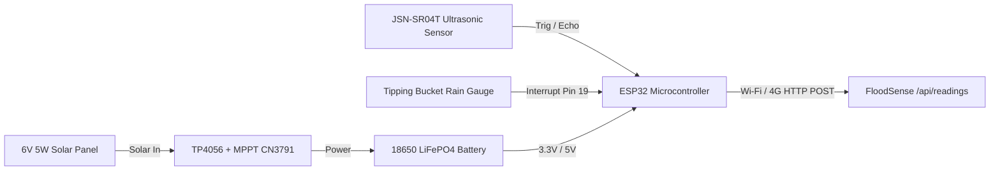

# Open Hardware Integration Guide & Physical Node Blueprint

## FOSSEE Open Hardware National Make-A-Thon 2026

---

### 1. Hardware Architecture Overview

While the 2026 National Make-A-Thon round is software-only, FloodSense features a complete, deployment-ready open hardware blueprint.



---

### 2. Microcontroller Firmware Specification (`node_firmware.ino`)
- **Target MCU**: ESP32-WROOM-32 DevKit V1
- **Sensor Peripherals**:
  - `JSN-SR04T-V3.0` Waterproof Ultrasonic Transducer (20cm to 600cm range)
  - Reed Switch Tipping Bucket Rain Gauge (0.2794 mm per tip)
  - Voltage Divider ADC on GPIO 34 for LiFePO4 battery monitoring
- **Data Ingestion Standard**:
  Sends JSON payload over HTTP POST to `/api/readings` identical to the virtual sensor simulator:
  ```json
  {
    "node_id": "KL-PER-01",
    "water_level_cm": 420.5,
    "rainfall_mm_hr": 12.4,
    "battery_pct": 96.5,
    "rssi": -62
  }
  ```

---

### 3. Physical Installation Guide
1. **Bridge/Pole Mounting**: Mount JSN-SR04T transducer vertically over riverbed attached to high bridge girder or 2-inch galvanized pole.
2. **Mounting Height Calibration**: Program `SENSOR_MOUNT_HEIGHT_CM` parameter in `node_firmware.ino` (e.g. 800.0 cm from riverbed).
3. **Power Autonomy**: Position 6V 5W solar panel facing true South angled at 15 degrees.
