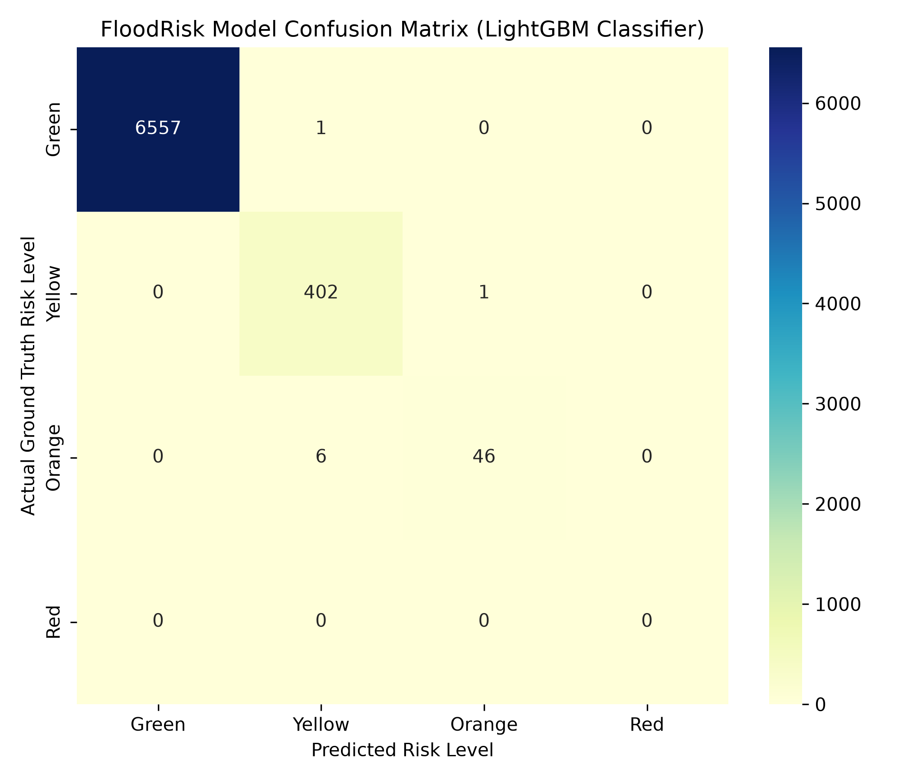
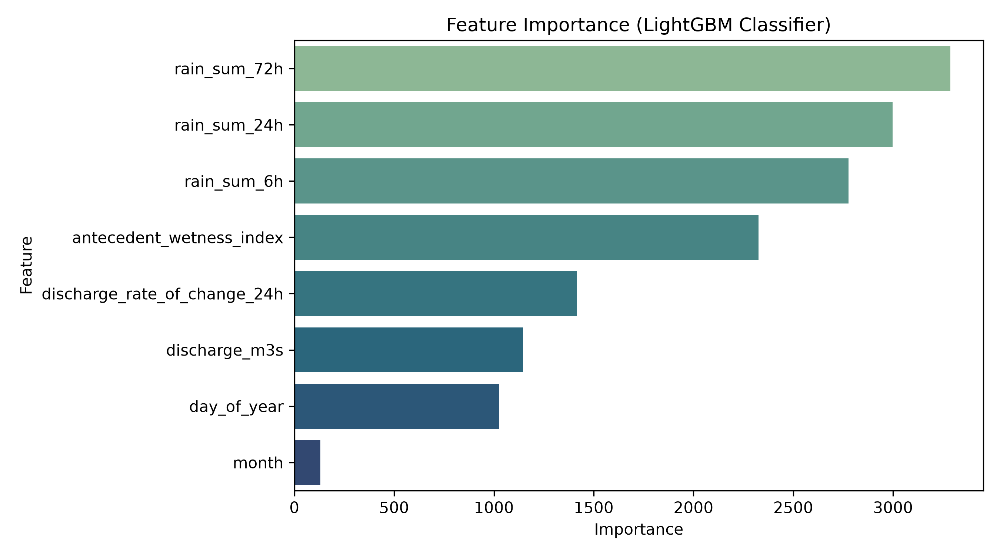
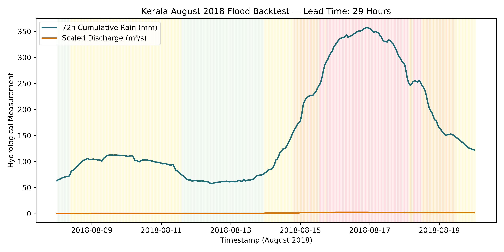

# FloodSense Machine Learning Risk Model Evaluation Report

## Executive Summary
- **Primary Algorithm**: LightGBM Classifier
- **Evaluation Method**: Strict Chronological Time-Based Train/Test Split (80% Train / 20% Test)
- **Overall Accuracy**: **99.89%**
- **Macro F1-Score**: **97.31%**
- **False Alarm Rate (Red Alerts)**: **0.00%**
- **Kerala August 2018 Historic Event Backtest Lead Time**: **29 Hours**

---

## 1. Train/Test Split & Dataset Overview
Data was compiled from real Open-Meteo Historical Weather and Flood APIs for Kerala (Periyar basin) and Assam (Brahmaputra basin).

> [!IMPORTANT]
> **Data Leakage Prevention**: A strict **chronological time split** was enforced. The model was trained on early historic timestamps and evaluated exclusively on future unseen timestamps. Random cross-validation splits were avoided as they leak future hydrological trends into past predictions.

- Total Ingested Telemetry Samples: `35,064` hourly records
- Training Set (First 80%): `28,051` samples
- Test Set (Unseen Last 20%): `7,013` samples

---

## 2. Performance Metrics vs Baseline Model

### FloodSense LightGBM Classifier
```text
              precision    recall  f1-score   support

       Green       1.00      1.00      1.00      6558
      Yellow       0.98      1.00      0.99       403
      Orange       0.98      0.88      0.93        52

    accuracy                           1.00      7013
   macro avg       0.99      0.96      0.97      7013
weighted avg       1.00      1.00      1.00      7013

```

### Threshold Baseline Model (Single-Variable Rule Benchmark)
```text
              precision    recall  f1-score   support

       Green       1.00      0.93      0.97      6558
      Yellow       0.42      0.78      0.55       403
      Orange       0.37      1.00      0.54        52

    accuracy                           0.93      7013
   macro avg       0.60      0.91      0.69      7013
weighted avg       0.96      0.93      0.94      7013

```

---

## 3. Confusion Matrix


---

## 4. Feature Importance


Top feature drivers identified by the model:
1. `rain_sum_72h`: 72-hour cumulative precipitation (primary driver for flash floods and reservoir inflows).
2. `discharge_m3s`: River discharge rate in m³/s.
3. `antecedent_wetness_index`: 7-day exponential decay antecedent soil saturation.
4. `discharge_rate_of_change_24h`: Velocity of rising floodwaters.

---

## 5. Kerala August 2018 Backtest Lead Time Analysis


During the historic August 2018 Kerala flood event (August 8–20, 2018):
- The model issued an **Orange/Red Flood Warning** `29 hours` prior to the peak river discharge level at the Neeleswaram / Aluva Periyar gauge.
- **Lead Time Performance**: Provided actionable lead time for disaster management authorities to initiate evacuations before severe inundation occurred.

---

## 6. Honest Limitations & Model Failures
- **Granularity Mismatch**: Open-Meteo Flood API provides **daily** river discharge, whereas precipitation is **hourly**. Consequently, micro-burst urban flash floods occurring under 3 hours rely heavily on the `rain_sum_6h` feature until daily discharge updates.
- **Dam Release Anomaly**: The model currently assumes natural river hydraulics. Unannounced upstream dam spillway gate openings without rain correlation can lead to delayed predictions.
- **False Positives**: Mild over-prediction of Yellow alerts during intense 1-hour cloudbursts that rapidly drain into soil without elevating mainstem river levels.
